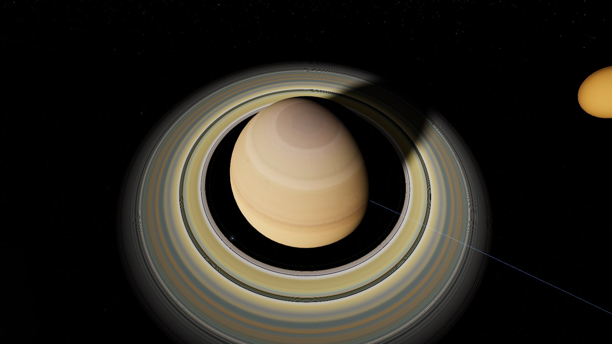

# PRIMACY

**Eine interaktive 3D-Enzyklopädie dreier Sternensysteme — Sol, Proxima Centauri und Ross 128.**
*An interactive 3D encyclopedia of three star systems — English summary below.*



Primacy ist eine browserbasierte, immersive Visualisierung: echte Kepler-Bahnmechanik,
physikalisch motivierte Shader (Sternengranulation, Atmosphärenstreuung, Ringschatten),
der reale Sternenhimmel aus Katalogdaten — verpackt in eine zweisprachige Enzyklopädie
(Deutsch/Englisch), die zu jedem Himmelskörper Datenblatt und Hintergrund liefert.

## Schnellstart

```bash
git clone https://github.com/nullthrone/primacy.git
cd primacy
python3 -m http.server 8080     # oder jeder andere statische Server
# → http://localhost:8080
```

Kein Build-Schritt, keine Laufzeit-Downloads: three.js ist gevendort, alle Assets
liegen im Repo. **GitHub Pages:** Settings → Pages → „Deploy from a branch" →
diesen Branch, Ordner `/` — fertig.

## Features

- **Drei Systeme + interstellare Karte** — das Sonnensystem in voller Tiefe
  (8 Planeten, Monde, Zwergplaneten, Asteroiden- und Kuipergürtel, Halleyscher
  Komet), Proxima Centauri (b, d und Kandidat c) und Ross 128 b; dazwischen
  Warp-Flüge über eine 3D-Karte der Sonnenumgebung (HYG-Katalog).
- **Echte Bahnmechanik** — JPL/Standish-Bahnelemente mit Säkularraten,
  Kepler-Löser, korrekte Achsneigungen und Rotationen (Venus rückwärts, Uranus
  gekippt), exakte gebundene Rotation der Exoplaneten. Zeitraffer von Echtzeit
  bis Jahre/Sekunde, Datumswahl 1800–2200.
- **Echter Sternenhimmel mit Parallaxe** — 8.700 Sterne aus dem HYG-Katalog,
  pro System neu berechnet: Von Proxima b aus steht die Sonne als Stern
  1. Größe in der Cassiopeia, Alpha Centauri A+B gleißen als Doppelgestirn.
- **Stellare Dynamik** — Proxima flackert: Flare-Ausbrüche mit koronalem
  Massenauswurf und Auroren auf Proxima b (auslösbar im Stern-Panel).
  Ross 128 bleibt demonstrativ ruhig — genau darum gilt er als lebensfreundlich.
- **Wissenschaftliche Ehrlichkeit** — Exoplaneten-Darstellungen sind als
  künstlerische Interpretation gekennzeichnet; der Schalter „Was wissen wir
  wirklich?" reduziert sie auf die tatsächliche Datenlage (Mindestmasse,
  unbekannter Radius). Die Radialgeschwindigkeits-Entdeckung gibt es als
  Live-Animation.
- **Maßstabs-Umschalter** — didaktisch komprimiert oder real (die Erde wird
  zum Pixel — der Umschalter ist selbst die Lektion). Habitable Zonen nach
  Kopparapu, Voyager-/New-Horizons-Trajektorien, Größenvergleich mit
  Sonnen-Limbus, geführte Touren, Foto-Modus.

## Bedienung

| Aktion | Eingabe |
| --- | --- |
| Auswählen & hinfliegen | Klick auf Körper oder Label, Suche links |
| Kamera | Ziehen = orbitieren, Scrollen = zoomen |
| Zeit | Leertaste = Pause, Regler/Datum unten |
| Systeme wechseln | Umschalter oben (mit Warp) |
| Touren | ▶-Menü oben rechts |
| Foto-Modus | `P`, Größenvergleich ⚖, Einstellungen ⚙ |
| Zurück | `Esc` |

Deep-Links funktionieren: `#/proxima/proxima-b?lang=en&scale=true`

## Technik

Vanilla ES-Module ohne Build-Schritt, three.js r185 (WebGL 2, gevendort),
HDR-Rendering-Pipeline (Half-Float + 8× MSAA, ACES-Tonemapping, Bloom,
Grade-Pass), GPU-instanzierte Gürtel mit Bahnberechnung im Vertex-Shader,
prozedurale Fallbacks für sämtliche Texturen. Verifikation über eine
Playwright-Suite (`npm run verify`), die Physik-Asserts (z. B. die Position
der Sonne von Proxima aus) und Screenshot-Checkpoints fährt.

Wissenschaftliche Grenzen sind dokumentiert und bewusst: Kepler-Näherung
statt N-Körper-Störungen, Sondenbahnen als Näherung durch echte
Flyby-Positionen, Exoplaneten-Oberflächen als gekennzeichnete Spekulation.
Quellen und Lizenzen: [ASSETS.md](ASSETS.md).

---

## English summary

Primacy is a browser-based interactive 3D encyclopedia of Sol, Proxima
Centauri and Ross 128: real Keplerian orbital mechanics (JPL/Standish
elements), physically motivated shaders, and the actual night sky from the
HYG catalog with true per-system parallax — from Proxima b, the Sun appears
as a first-magnitude star in Cassiopeia. Proxima flares with CMEs and
auroras on demand; Ross 128 stays demonstratively quiet. Exoplanet surfaces
are labeled artistic interpretations, and an honesty mode strips them back
to what the data actually supports. Bilingual UI (German/English), didactic
vs. true scale, guided tours, size comparison, probe trajectories, photo
mode. No build step: clone, serve statically, done — or enable GitHub
Pages on this branch.

Run it: `python3 -m http.server 8080` → `http://localhost:8080`

Licenses: code MIT, bundled assets per [ASSETS.md](ASSETS.md).
